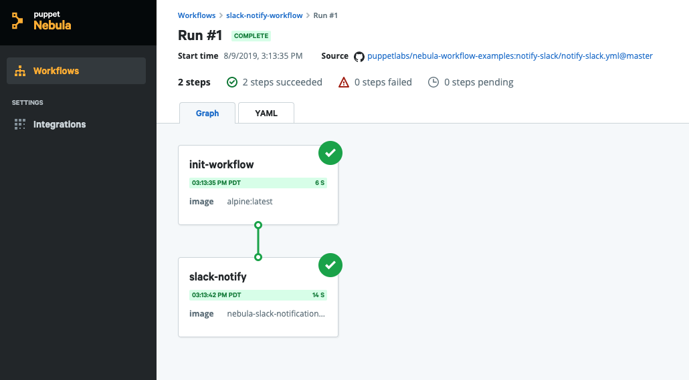

# Notify your team with Slack  

This workflow sends a customized message to a channel in your organization's
Slack messaging app.

## Prerequisites

Before you run the workflow, make sure you have access to a Slack authentication
token. For more information, see [Getting a Slack token](https://get.slack.help/hc/en-us/articles/215770388-Create-and-regenerate-API-tokens). 

## Run the workflow

Follow these steps to run the workflow:
1. Add your Slack authentication token to the workflow as a secret.
   1. Click **Edit** > **Secrets**.
   2. Click **Define new secret** and use the following values:
      - **KEY**: `slack-token`
      - **VALUE**: Enter your Slack authentication token
2. Configure your workflow parameters.
   1. Click **Run** and enter a room name and message. For example:
      - **Channel**: `nebula-workflows`
      - **Message**: `:tv: This is a test. Do not adjust your sets. :tv:`  
3. Click **Run workflow** and wait for the workflow run page to appear. 

After the run completes, your message shows up in the channel you specified.

Next, provision and deploy a Google Kubernetes Engine (GKE) cluster using Terraform.

**Useful topics:**
- This workflow uses the Slack notification step curated by Puppet. To find out
more about the the step, see [Slack notification](../step-specifications/slack-notification.md).
- For more information on our curated step specifications, see [Step specifications](../step-specifications.md).
- If your team uses Microsoft teams, try the [Microsoft Teams notification](../step-specifications/msteams-notification.md) step.

