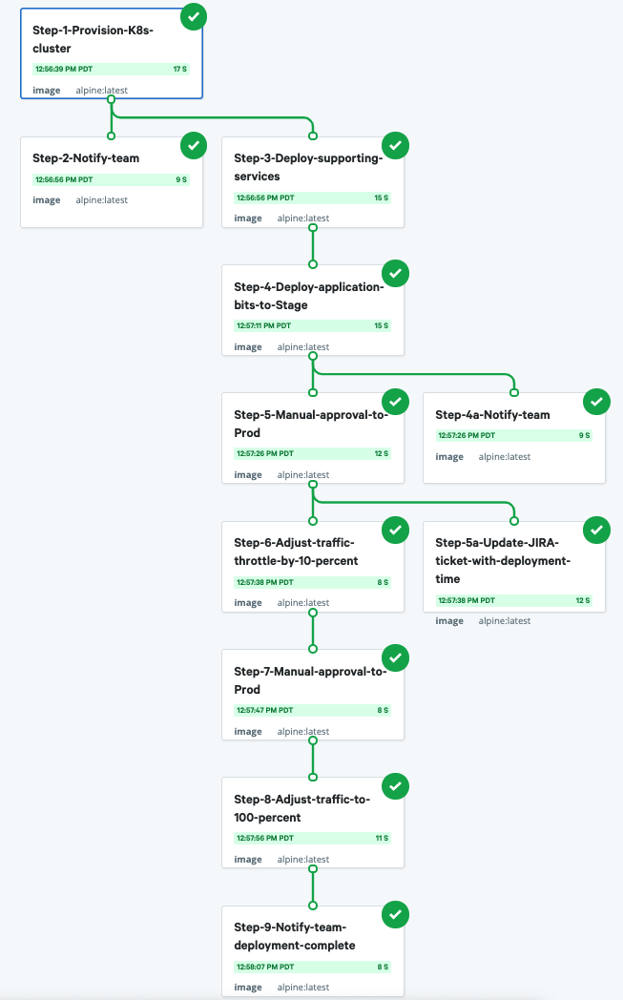

# Sample workflow

This sample workflow models the types of steps you can execute with Nebula. Use
it to familiarize yourself with the Nebula interface. 

To run the workflow from the Nebula web interface, click **Workflows** >
**sample-workflow** > **Run**. After the run initiates, the run page opens.

You can access the following information from the sample workflow run page:
-  Click **Graph** to view a visualization of the workflow.
-  Click **Code and data** to view the YAML for the workflow.
-  Click **Logs** and select a step to view the log output for that step.

Next, try sending a Slack notification to your team using the [Slack
notification](./notify-slack.md) workflow.

