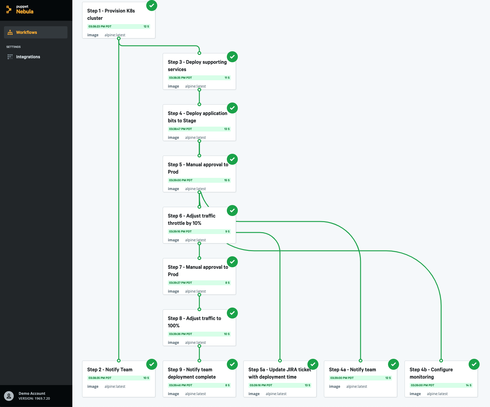

# Sample Workflow

DEMO: This is an example workflow that models the types of Workflow steps that a user can execute within Nebula. It shows how to specify dependencies and author Workflow files.

<h4 align="center"></h4>
